= Chexr Receipts User Manual

As an API, the Chexr Receipts project does not have a user interface, but a set of functions that provides it's functionality.

This manual is designed as follows: first, we instruct how to create new Banks and Merchants, then we will learn how a Bank and a Merchant can operate with our API.

For the purpose of this tutorial, we are going to use Postman to do API requests. You can download it for free link:https://www.postman.com/downloads/[here].

== User Setup

Currently, the system has 3 user types: `admin`, `merchant` and `bank`. The `admin` has permission to create banks and merchants, while `merchant` can operate Merchant API, and `bank` can operate Bank API.

*The following initial steps, are the same for every user type*.

1. Go to Cognito Service and Select "Manage User Pools"

+
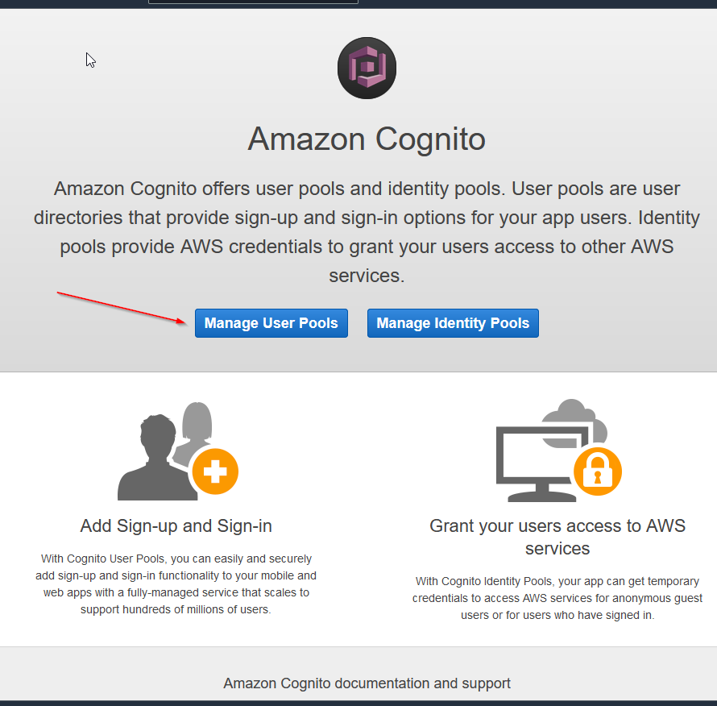

1. Select the correct user pool

+
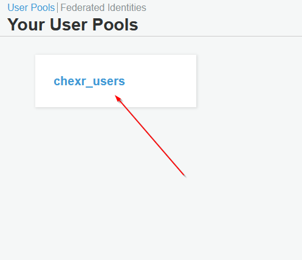

1. Using the lateral menu, select "app clients"

+
NOTE: All of our users are _app clients_, we are not handling real users but systems that connect with our system.

1. You'll see a list of current app clients, and an option to create a new one.

+
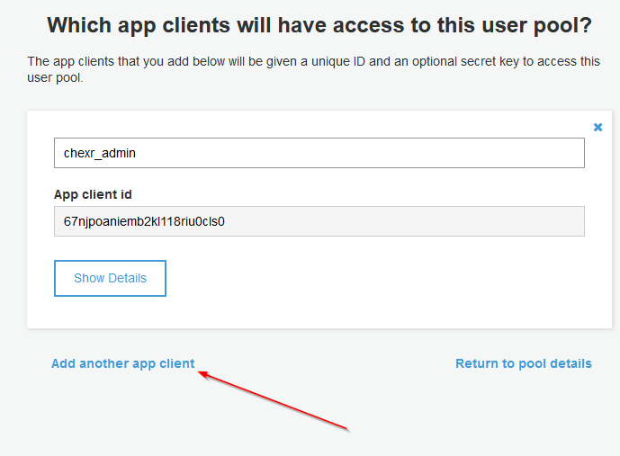

1. On the next screen, fill the desired client name and keep all the other options as is.

1. With the client created, AWS will give you an _app client id_ and _app client secret_. Keep it as it will be used and username and password for the API.

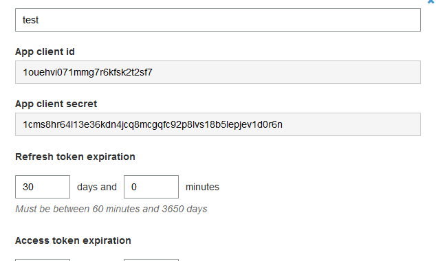

=== Creating an Admin user

The first user that needs to be set is an admin. Without it, it's impossible to create Merchants and Banks on the system.

1. With the _app client_ created using the steps above, go to the option *app client settings* in the lateral menu. 
1. Find the _app client_ desired and enable `Client Credentials` auth flow. 

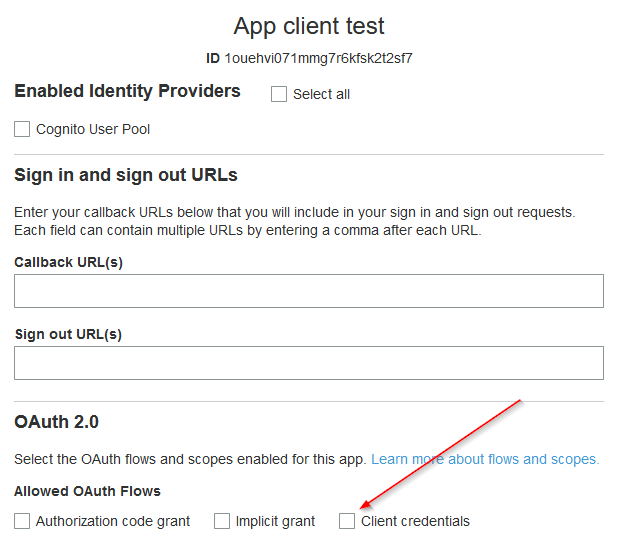

1. A new option will be appear with all scopes our application has. Just check `receipts/admin` and save changes.

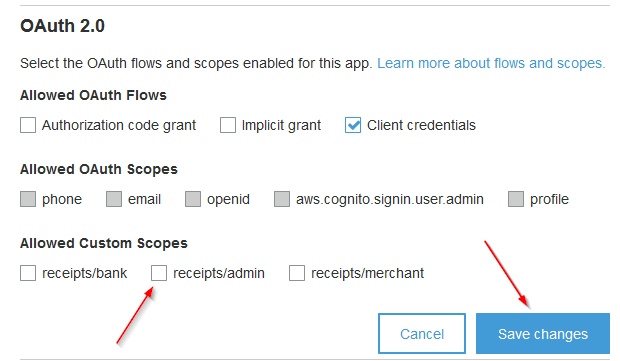

=== Creating a Merchant and providing credentials

NOTE: You need an admin user and it's `client id` and `client secret` to continue.

1. With the _app client_ created using the steps above, go to the option *app client settings* in the lateral menu. 
1. Find the _app client_ desired and enable `Client Credentials` auth flow. 

+

1. A new option will be appear with all scopes our application has. Just check `receipts/merchant` and save changes.

+
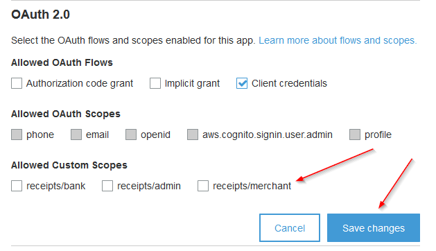

1. The client is configured and correctly set on Cognito, but Chexrs application also needs to know to which merchant this app client is associated. For this, we have an API to create or update merchants.

1. Get an admin access token by following the appendix <<user_authentication>>

1. Using postman, send the following body to URL: https://api.chexr.com/admin/v1/merchant using `PUT` method:

+
    {
        "client_id": "55h6113j84knf3asoh43qeauAAA",
        "name": "Raphael",
    }
+
Where `client_id` is the client identifier generated before. If you need to update a merchant, just do the same, but include it's ID:

    {
        "client_id": "55h6113j84knf3asoh43qeauAAA",
        "name": "Raphael",
        "id": "6098122bde5de3ba93842f81"
    }

To list all merchants, change from `PUT` to `GET` and the system will return the list of merchants.

=== Creating a Bank and providing credentials

NOTE: You need an admin user and it's `client id` and `client secret` to continue.

1. With the _app client_ created using the steps above, go to the option *app client settings* in the lateral menu. 
1. Find the _app client_ desired and enable `Client Credentials` auth flow. 

+

1. A new option will be appear with all scopes our application has. Just check `receipts/bank` and save changes.

+
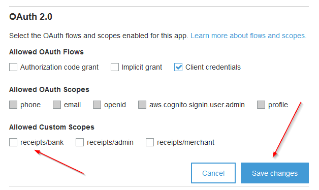

1. The client is configured and correctly set on Cognito, but Chexrs application also needs to know to which bank this app client is associated. For this, we have an API to create or update banks.

1. Get an admin access token by following the appendix <<user_authentication>>

1. Using postman, send the following body to URL: https://api.chexr.com/admin/v1/bank using `PUT` method:

+
    {
        "client_id": "55h6113j84knf3asoh43qeauAAA",
        "bank_name": "Wells Fargo",
        "url_upload_receipts": "https://api.wellsfargo.com/chexr/receipts",
        "jws_signature":""
    }
+
Where `client_id` is the client identifier generated before. If you need to update a bank, just do the same, but include it's ID:

    {
        "client_id": "55h6113j84knf3asoh43qeauAAA",
        "id": "6098122bde5de3ba93842f81",
        "bank_name": "Wells Fargo",
        "url_upload_receipts": "https://api.wellsfargo.com/chexr/receipts",
        "jws_signature":""
    }

To list all banks, change from `PUT` to `GET` and the system will return the list of merchants.

== Merchant API and Bank API

Please refer to the OpenAPI documentation:

https://api.chexr.com/openapi.json

(you have to be authenticated to download this file)

Use an OpenAPI viewer to load the file (eg. https://editor.swagger.io/)

[appendix]
== [[user_authentication]] User Authentication

To properly use an API, the application needs first to authenticate to obtain an _access token_. This token will then be used by all API's.

To get a token, just call the following `POST` command on the authentication endpoint: 
`https://auth.chexr.com/oauth2/token`

Fill basic authentication using `client id` as username and `client secret` as password. 

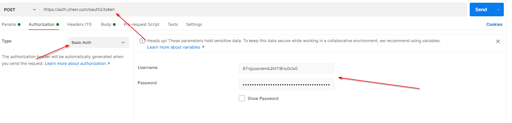

It also needs a form based parameter called `grant_type` with value `client_credentials`, to indicate which authentication flow will be used.

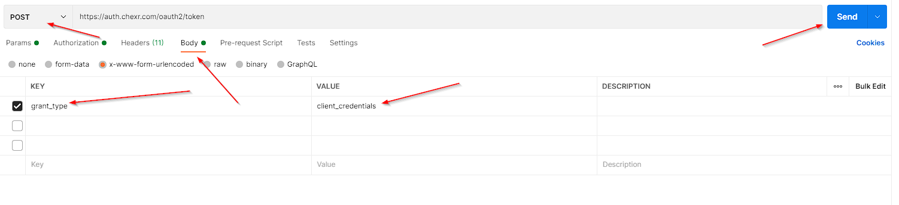

The server will reply with some information, we are going to use the data in _access token_ field.

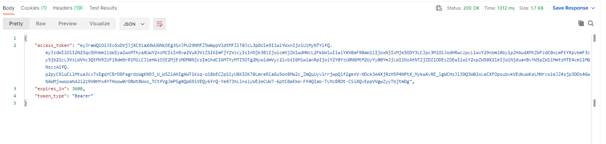

Now, you can access any API endpoint by setting the Auhtorization to `bearer` and putting the _access token_ in the field opened. Note that if you try to use an API that is not allowed to your profile, you'll receive an error.